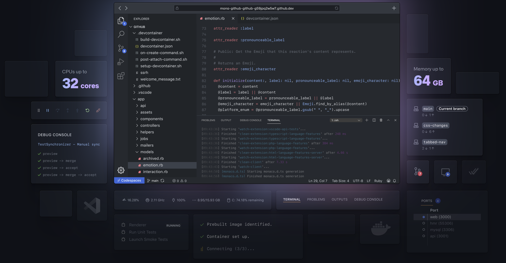
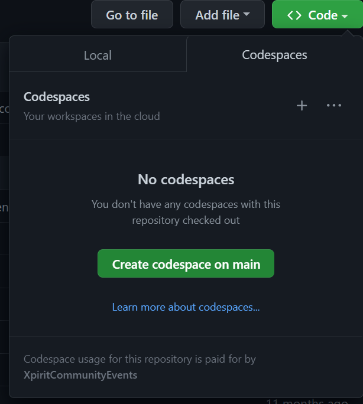
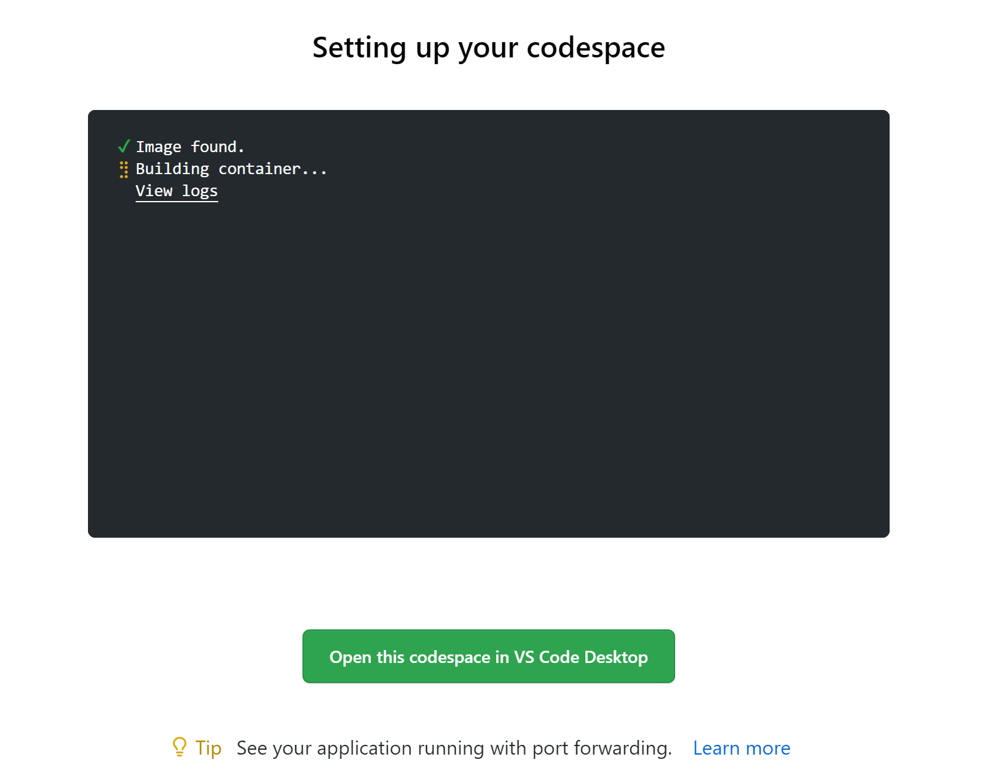
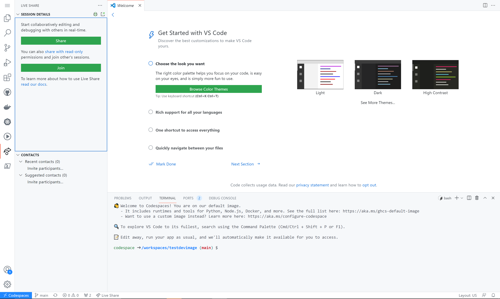
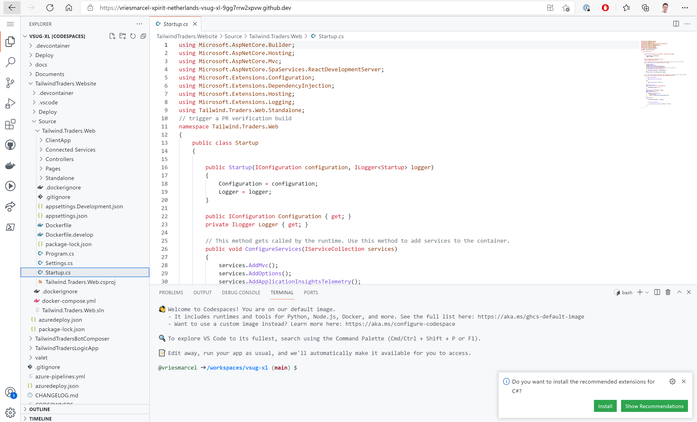
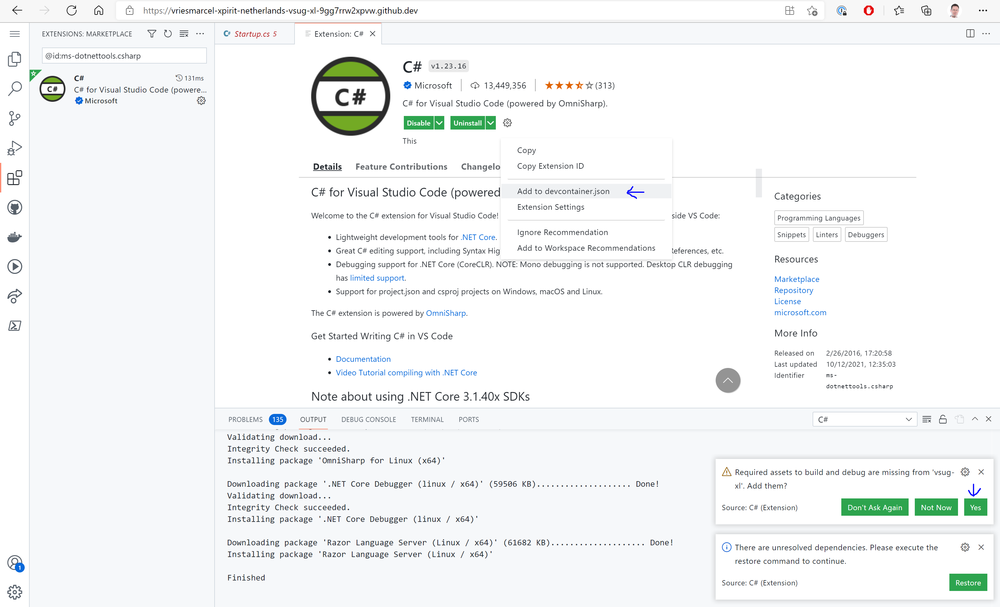
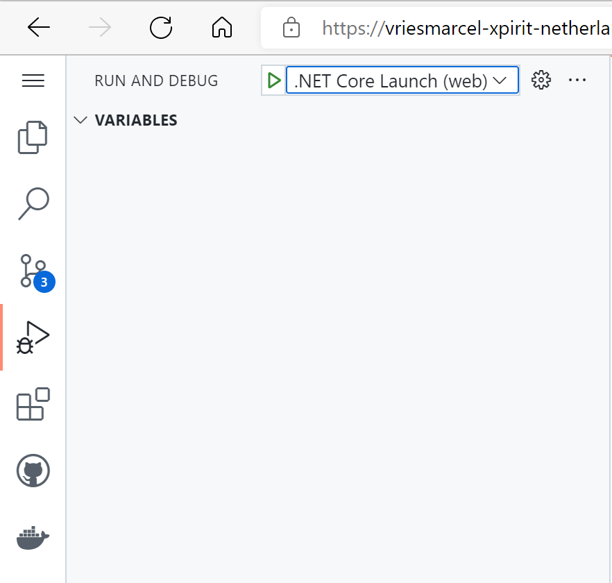
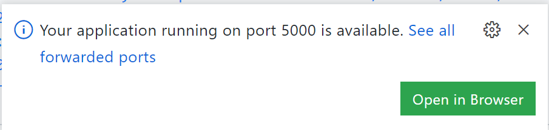
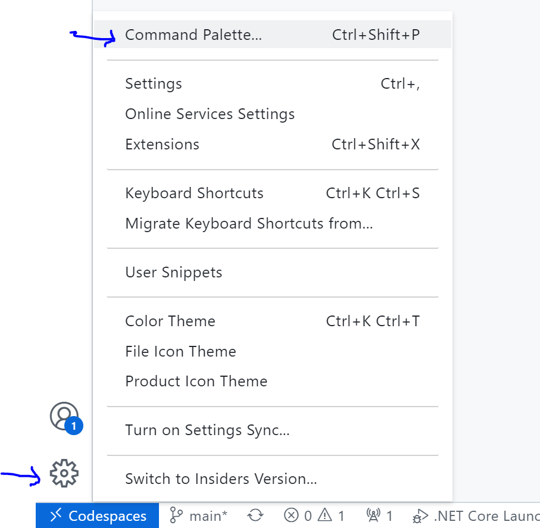

# 🔨 Hands-on: Setting up Codespaces to develop a web-app

You just migrated a repository that contains a web application. With CodeSpaces you can configure a full development environment as part of your code repository. 

For more information on CodeSpaces, visit: [https://github.com/features/codespaces](https://github.com/features/codespaces)

## Objectives of this hands-on lab
This hands-on lab introduces you to the concept of CodeSpaces, working with Codespaces and prepares your CodeSpaces environment for the subsequent hands-on labs, where you will further experience the benefits of working with CodeSpaces.

This hands on lab consists of the following steps:
- [🔨 Hands-on: Setting up Codespaces to develop a web-app](#-hands-on-setting-up-codespaces-to-develop-a-web-app)
  - [Objectives of this hands-on lab](#objectives-of-this-hands-on-lab)
  - [Setting up your CodeSpaces development environment](#setting-up-your-codespaces-development-environment)
  - [Adjusting CodeSpaces for your team and your type of work](#adjusting-codespaces-for-your-team-and-your-type-of-work)
  - [Checking if we can debug our web application](#checking-if-we-can-debug-our-web-application)
  - [Making a code change](#making-a-code-change)
  - [Committing the changes to the devcontainer](#committing-the-changes-to-the-devcontainer)
  - [Rebuilding the devcontainer](#rebuilding-the-devcontainer)

## Setting up your CodeSpaces development environment
1. Please go to your repository and start your Codespace instance by clicking the button `Code`, then the tab `Codespaces` and select `Create codespace on main`.

2. The first time you create a CodeSpace environment, you will see the following screen.

Please wait for this to complete. The reason it takes some more time the first time has to do with the fact the container needs to be build for the first time. Next time you start a CodeSpace you will get access in a few seconds.

3. When your CodeSpace is ready you will see the full IDE appear in your browser. This is a full Visual Studio Code experience in your browser! This looks as follows:

Once you are in your CodeSpace environment, you can follow the next steps to add an extension to your Code Space environment.

## Adjusting CodeSpaces for your team and your type of work

You will now make changes to the CodeSpaces environment so you are able to do software development as a web developer using .NET and C#.

We will make use of the `auto detect` features of Visual Studio Code by browsing to one of the C# files that makes up the web solution in your repository.

1. In the file explorer,  browse to the file `startup.cs` which van be found in the folder `TailwindTraders.Website\Source\Tailwind.Traders.Web`. The moment you open the file `startup.cs` you will see a pop-up appear in the bottom right corner of your ide.

2. Click on the `Install` button so the plugin gets installed in this instance of codespaces.

3. While the plugin gets installed, we would like the installation not only to be in this instance but also for all your team mates. For this you click the gear icon in the extensions window and select the option `Add to devcontainer.json`

4. In the meanwhile you also should see some messages popping up from the plugin that it is missing assets. Click on the yes button to add them to the project.

>Note: You'll get a pop-up stating "*We've noticed a change to the devcontainer configuration. Rebuild the container to apply them now*". We will wait with this, so please dismiss this dialog. 

## Checking if we can debug our web application
1. The new plugin added the option to debug .NET applications. In the left of your screen you will see the button with the `Play` icon on there and a little symbol of a bug. Click this button and it will open the debug tools. In the top of the window you can now select which application you would like to debug. Select the application `.NET Core Launch (web)` 

2. The moment you click the small play button in the top, the debugger will start. In your console in the bottom, you will see the compilation process. 
>Note: The actual compilation is now done in the devcontainer running in the cloud. The output you see is streamed from that container and the commands for debugging are send to this container

3. Next you will see a popup in the right bottom corner and if you have a pop-up blocker enabled a message a popup is blocked. This is because the debugger tries to start a new window that shows the website you are debugging. You either need to enable the pop-up or click on the message in the bottom `Open in Browser` on the forwarded port.

4. In the new opened tab you should now see the Tailwind Traders website. You are now running your website inside the Codespace and are debugging it locally! 🤯🤯🤯.

## Making a code change
In your IDE find the file `translation.json` which can be found in the folder `TailwindTraders.Website\Source\Tailwind.Traders.Web\ClientApp\src\assets`
In this file you will find the value for the free shipping promotion. We are going to change this from `$300` to `$100` as part of a holiday promotion.
After you have made a change to the file, go back to the tab with the website and see it changed there also immediately.

## Committing the changes to the devcontainer
We now know the plugin works great and we want to share this with our team. For this we need to commit some changes that were made during the exercise. First we want to commit the change to the website. For this you go to the Git tool window that can be found by the Git symbol in the left of your screen with a notification on there stating the number `3`.
This means we have 3 changes that we can commit.

1. You now first stage the change to the `translation.json` file. And you commit this change to the local repo.

2. Next you stage the `devcontainer.json` and the `launch.json` file as a separate commit.

3. Now that your changes have been saved, you can rebuild the container and validate that it works as expected with a new fresh CodeSpaces instance.

## Rebuilding the devcontainer
1. Open the Command Palette. Use either (`CTRL+SHIFT+P`/`CMD+SHIFT+P`) or or use the cog icon in the left bottom corner and open the command palette over there.

2. Now type "*Rebuild Codespace*". [More information can be found here](https://docs.github.com/en/codespaces/customizing-your-codespace/configuring-codespaces-for-your-project#applying-changes-to-your-configuration).

Great job! :thumbsup: You've now added an extension to the CodeSpaces container in a way that will ensure this extension is always available when you open your CodeSpace. So, next time you open your CodeSpace, even if it was disabled, this extension will be available without any manual intervention.
