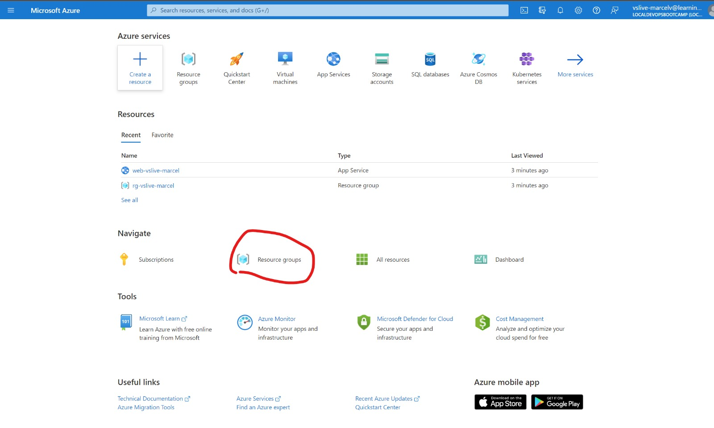

# 🔨 Hands-on: Building  and deploying a .NET web application

## Objectives of this hands-on lab
Let's use the power of GitHub Actions to create a Continuous Integration workflow for our .NET Core project. With Continuous Integration, we can ensure that our project is ready to be deployed to production by building it each time code changes are pushed to the GitHub repo.

This hands on lab consists of the following steps:
- [🔨 Hands-on: Building  and deploying a .NET web application](#-hands-on-building--and-deploying-a-net-web-application)
  - [Objectives of this hands-on lab](#objectives-of-this-hands-on-lab)
  - [Create a Continuous Integration workflow](#create-a-continuous-integration-workflow)
  - [Install correct version of node and .NET tooling](#install-correct-version-of-node-and-net-tooling)
  - [Add the build commands](#add-the-build-commands)
  - [Publish Artifacts](#publish-artifacts)
  - [Final Result workflow](#final-result-workflow)
    - [Use environment variables in the workflow](#use-environment-variables-in-the-workflow)
    - [Extract a .NET template for reuse](#extract-a-net-template-for-reuse)
    - [Deploy to the cloud](#deploy-to-the-cloud)
- [Deploy web app from the GitHub Action Workflow](#deploy-web-app-from-the-github-action-workflow)

## Create a Continuous Integration workflow
The goal of implementing Continuous Integration is to build our application whenever someone pushed their code changes to the GitHub repo. That way we create a fast feedback cycle and verify that the incoming code changes actually can be build on a different machine than the one of the developer that made the changes. This prevents the issue of 'works on my machine'. Inside the Continuous Integration workflow, we can also build in more checks to verify that our software still works as expected or check for security issues.

Let's start by creating a new GitHub Actions workflow and name it `ci build.yml`. Don't forget to store the workflow in the `.github/workflows` folder.

The basic structure of a GitHub Actions workflow that triggers in a push on the main branch and a pull request on the main branch, where files are changed that are related to the web application. We also want to be able to trigger the workflow from the GitHub UI, for this we add a trigger called workflow_dispatch. HEre is the snippet of Yaml needed to make this happen:
```YAML
name: Build, Test, Publish and Deploy
on:
  workflow_dispatch:
  push:
    branches: [ main ]
    paths:
      - 'TailwindTraders.Website/**'
  pull_request:
    branches: [ main ]
    paths:
      - 'TailwindTraders.Website/**'
jobs:
  build:
    runs-on: ubuntu-latest
    steps:
    - uses: actions/checkout@v2
```
Commit the workflow and verify that it runs correctly. You can validate this by going to the actions tab in your GitHub repo and there click the name of the actions workflow. Then you have the option to trigger the workflow via the portal. This should as follows:


Click the button `Run Workflow` and check the results. 

## Install correct version of node and .NET tooling
To be able to run the correct versions of node and .NET, we can install those tools at runtime using the `actions/setup-node@v1`  step. Add these to your workflow:

```YAML
 - name: Use Node 10.16.3
   uses: actions/setup-node@v1
   with:
     node-version: 10.16.3
```
Commit the workflow and verify that it runs correctly.

## Add the build commands
To run the .NET commands we can use shell commands. Note that we need to tell .NET where to find the project to run:
```YAML
   - name: Install dependencies in client app
      working-directory: TailwindTraders.Website/Source/Tailwind.Traders.Web/ClientApp
      run: npm install

    - name: Build and publish with dotnet
      working-directory: TailwindTraders.Website/Source
      run: |
        dotnet build --configuration Release
   
   - name: Run rests
      working-directory: TailwindTraders.Website/Source
      run: |
        dotnet test --configuration Release
``` 
Commit the workflow and verify that it runs correctly.

## Publish Artifacts
To have an artefact to `publish` we need to create it using the command `dotnet publish` and let .NET package everything the application needs to be deployed later on. Then we can upload the resulting artefact to GitHub.

```YAML	
    - name: Publish with dotnet
      working-directory: TailwindTraders.Website/Source
      run: |
        dotnet publish -c Release -o ${{github.workspace}}/myapp

    - name: Upload artifact for deployment job
      uses: actions/upload-artifact@v2
      with:
        name: .net-app
        path: ${{github.workspace}}/myapp
```
Commit the workflow and check the logs. Look at the summary and the linked artifacts for the build. This file can later be used to deploy the application into a (cloud) environment.

## Final Result workflow
Your workflow file would now look like this:
```YAML
name: Build, Test, Publish and Deploy

on:
  push:
    branches: [ main ]
    paths:
      - 'TailwindTraders.Website/**'
  pull_request:
    branches: [ main ]
    paths:
      - 'TailwindTraders.Website/**'
jobs:
  build:
    runs-on: ubuntu-latest
    steps:

    - uses: actions/checkout@master

    - name: Setup Node
      uses: actions/setup-node@v1
      with:
        node-version: 10.16.3    

    - name: Install dependencies in client app
      working-directory: TailwindTraders.Website/Source/Tailwind.Traders.Web/ClientApp
      run: npm install

    - name: Build and publish with dotnet
      working-directory: TailwindTraders.Website/Source
      run: |
        dotnet build --configuration Release

    - name: Run rests
      working-directory: TailwindTraders.Website/Source
      run: |
        dotnet test --logger "trx;LogFileName=test-results.trx" --configuration Release

    - name: Publish with dotnet
      working-directory: TailwindTraders.Website/Source
      run: |
        dotnet publish -c Release -o ${{github.workspace}}/myapp

    - name: Upload artifact for deployment job
      uses: actions/upload-artifact@v2
      with:
        name: .net-app
        path: ${{github.workspace}}/myapp

```

### Use environment variables in the workflow 
[:hammer_and_wrench: DIY Link](https://damienaicheh.github.io/github/actions/2021/04/15/environment-variables-secrets-github-actions-en.html)

Look at your workflow file and determine what parts can be improved by adding central variables to the workflow. This will help reusing the workflow later on and make it easier to configure.

Tip: extract at least the following parameters and pass them into the right steps:
```YAML
BuildConfiguration: Release
PathToProject: TailwindTraders.Website/Source
```

### Extract a .NET template for reuse
You can see that the two workflows we have created are quite similar. We can extract a template for the .NET workflow and reuse it in both workflows. This template can then even be used withing the entire organization as the standard .NET workflow. Let's build a [reusable workflow](https://docs.github.com/en/actions/learn-github-actions/reusing-workflows)!

> Note: Reusable workflows are currently in beta and subject to change.

1. Create a new reusable workflow file in the same folder: `.github/workflows`
1. Add inputs for the the environment parameters used in the current workflows.
1. Add a parameter name `Publish` and set its type to `boolean` and set its default value to `false`.
1. Add all the steps from the `build` job into the reusable workflow.
1. Store the new reusable workflow.
1. Update your workflow(s) to use the new reusable workflow instead of all the steps.
1. Check the output and the difference between the two values for the `Publish` parameter.
1. Check the current limitations for reusable workflows in the [documentation](https://docs.github.com/en/actions/learn-github-actions/reusing-workflows).

The reusable workflow file will start with the inputs:
```YAML	
on:
  workflow_call:
    inputs:
      BuildConfiguration:
        required: true
        type: string
```

Note that the reusable workflow must be used with the full `owner/repo-name` notation:
```YAML	
publish:
uses: XpiritCommunityEvents/attendee-rajbos/.github/workflows/dotnet-template.yml@main
with: 
  BuildConfiguration: Release
  PathToProject: TailwindTraders.Website/Source
  Publish: true
```

### Deploy to the cloud
For this step we are going to use the following  [marketplace action](https://github.com/marketplace/actions/azure-webapp) to deploy your application into your Azure cloud environment. 

First you need an web application in Azure that we can deploy to. A Web application has been created for you.
1. Open an In-Private Browser window
2. Go to [portal.azure.com](https://portal.azure.com)
3. Login with username `vslive-<yourgithubhandle>@learningxperiences.com`
4. And password: `Cuma6777`
5. After login, change password 
6. Browse to "Resource Groups"




# Deploy web app from the GitHub Action Workflow
Now add a second job to the workflow , that is going to deploy our web application to the cloud. 

For this we create a new job, use ubuntu-latest as the runner and we need to state we have a dependency on a previous job called build that we created before.

Here is the example of the way to start the new job with a depenency:

```YAML
deploy:
    runs-on: ubuntu-latest
    needs: build
```

Now we first need to download the artifacts from the previous job. If you used another name at publishing please ensure you use the same name here where you download the artifact.

Add the following step:
```YAML
    steps:
      - name: Download artifact from build job
        uses: actions/download-artifact@v2
        with:
          name: .net-app
```

The final step in the publication is we need to use the Azure deploy to web app action. and we need to provide it the following parameters:
- The name of the web app in azure
- The credentials that has the rights to publish to the web app. 

You can obtain these credentials from the Azure Web app, by downloading the so called publishing profile. You can download the profile here in the azure portal at your web application:


When you download the file you can copy the full contents and pass it in as a string when you assign it to the input variable publish-profile.

This looks like this:
```YAML
      - name: Deploy to Azure Web App
        id: deploy-to-webapp
        uses: azure/webapps-deploy@v2
        with:
          app-name: '<yourappnamehere>'
          slot-name: 'production'
          publish-profile: '<publishData><publishProfile profileName="Tailwind-vslive - Web Deploy" publishMethod="MSDeploy" publishUrl="tailwind-vslive.scm.azurewebsites.net:443" msdeploySite="Tailwind-vslive" userName="$Tailwind-vslive" userPWD="5mCyEWmuEu81muTRvm1Li0cLLCuJcSZjLaiMQjeSkW8nFFn8WE4rT4Nahm0H" destinationAppUrl="https://tailwind-vslive.azurewebsites.net" SQLServerDBConnectionString="" mySQLDBConnectionString="" hostingProviderForumLink="" controlPanelLink="http://windows.azure.com" webSystem="WebSites"><databases /></publishProfile><publishProfile profileName="Tailwind-vslive - FTP" publishMethod="FTP" publishUrl="ftps://waws-prod-dm1-301.ftp.azurewebsites.windows.net/site/wwwroot" ftpPassiveMode="True" userName="Tailwind-vslive\$Tailwind-vslive" userPWD="5mCyEWmuEu81muTRvm1Li0cLLCuJcSZjLaiMQjeSkW8nFFn8WE4rT4Nahm0H" destinationAppUrl="https://tailwind-vslive.azurewebsites.net" SQLServerDBConnectionString="" mySQLDBConnectionString="" hostingProviderForumLink="" controlPanelLink="http://windows.azure.com" webSystem="WebSites"><databases /></publishProfile><publishProfile profileName="Tailwind-vslive - Zip Deploy" publishMethod="ZipDeploy" publishUrl="tailwind-vslive.scm.azurewebsites.net:443" userName="$Tailwind-vslive" userPWD="5mCyEWmuEu81muTRvm1Li0cLLCuJcSZjLaiMQjeSkW8nFFn8WE4rT4Nahm0H" destinationAppUrl="https://tailwind-vslive.azurewebsites.net" SQLServerDBConnectionString="" mySQLDBConnectionString="" hostingProviderForumLink="" controlPanelLink="http://windows.azure.com" webSystem="WebSites"><databases /></publishProfile></publishData>'
          package: .
```


